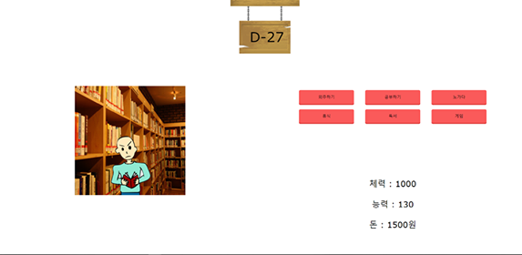

# DSM 전공 역량 강화 Camp 

내가 재학중인 학교 DSM(대덕 소프트웨어 마이스터 고등학교)에서 1박 2일간 캠프를 가게 되었다. 단순히 놀러 가는 것은 아니고, 소프트웨어적 `역량을 강화`하는 것을 목표로 하는 캠프이다.

캠프는 여러개의 주제가 있고 주제에 따라 강사님 한 분, 멘토님 한 분 그리고 강의를 듣는 학생들로 이루어져있었다. 학과 별로 강좌가 고정되어있었는데, 내가 속한 소프트웨어 개발과는 `Flask를 이용한 웹 서비스 개발`이 주제였다. 나는 평소에 Node.js로만 백엔드를 구축했었기 때문에 이번에 Flask를 경험할 수 있는 기회였다.

## 특강 : 프로젝트 계획서 작성하기

  먼저 Flask 강의를 듣기 전 회사에서는 어떻게 프로젝트를 진행하는 지에 대한 특강을 먼저 듣게 되었다. 

특강에서 먼저 프로젝트를 하기 전에 기안서와 제안서를 작성하여 프로젝트가 타당한지 확실히 검토한 후 부터 프로젝트가 시작된다는 것을 배웠다. 그리고 프로젝트를 시작한 후에도 주간 업무 보고서, 월간 업무 보고서 등으로 자신이 그동안 진행한 일들을 체계적으로 정리하여 제출한다는 것도 알게 되었다.

우리 동아리도 앞으로 프로젝트를 진행할 때 좋은 아이디어가 떠올랐다고 무작정 개발하는 것이 아닌 특강에서 배운 것처럼 타당성을 검토하고  업무보고를 하면서 체계적인 프로젝트 진행에 도전해보아야겠다.

## 본강 : Flask를 이용한 웹 서비스 개발

​	첫째날 오전 10시부터 본강을 시작했다. Flask를 배우기 전 먼저 Python3.7 , mariaDB, HeidiSQL 등을 설치하고 개발 환경 세팅을 진행했다. Python Flask는 Node의 node_modules와 package.json이 없어 가상 실행 환경을 세팅해야하는 것이 불편하다고 느꼈다.	

​	환경 세팅 후에는 가볍게 Python 소개와  간단한 문법을 훑어 보았다. 2시간 정도 기본을 다진 후 드디어 Flask 개발이 시작되었다. Flask 는 pip 로 먼저 설치해야 했다. 강사님께서 PPT로 설명과 코드를 보여주시면서 강의를 진행했다. 

배운 것들을 나열해보았다.

* Flask 기본 구조
* routing
* GET/ POST request
* query 와 body 처리
* templates 
* database 연동

등을 배웠다. 짧은 시간동안 배운지라 DB 연동은 조금 어려웠지만 대략적인 개념은 잡은 듯 했다.

## 경연 : 개발자 키우기 개발 / 1등!! 그리고 아쉬운점

​	둘쨋날에는 어제 배운 Python Flask를 활용해서 웹 서비스를 개발하고 발표하는 경연이 이루어졌다. 오전 10시부터 오후 2시까지 약 4시간 동안 기획 및 디자인, 개발, 발표 준비까지 모두 해야 했다. 원래는 이번에 배운 Flask로 서버를 짤 계획이었지만 시간이 없어 이번에는 기획과 디자인 그리고 PM을 맡았다.

​	우리는 처음에 웹 기반 클리커 게임을 만드려고 했다. 그래서 클릭을 통해 음식점을 운영하는 컨셉을 생각했는데, 클리커 게임은 클릭하자 마자 돈을 벌리는 게 맞다고 생각해서 판매와는 어울리지 않다고 생각했다. 고민 끝에, 거지 키우기를 패러디한 개발자 키우기를 만들게 되었다.

​	역할 분담을 하여 서버, 프론트, 기획, 디자인, 발표 준비로 나누었는데, 내가 맡은 기획과 디자인이 끝나자 발표와 개발을 조금씩 도와주었다. 서버 연동과 게임 로직 작성에서 오류가 많아서 내가 개발에 참여하지 못하니까 너무 답답했었다. 그래도 친구들이 잘 오류를 찾아 해결하여 시연을 진행할 수 있었다. 총 시간이 4시간도 채 되지않아 처음에 기획했던 상점과 랭킹을 구현하진 못했지만 핵심인 게임 자체는 구현했다. 다행히 시간이 부족했던 것은 우리 팀만 그런 것은 아니었고 다른 팀도 전체적으로 완성도가 부족했다.

​	발표를 마치고 수상팀 발표를 했는데, 1등팀이 우리 팀이었다. 2등 할 거 같았는데, 1등을 하게 되어 기분이 좋았다. 약간 아쉬운 점은 너무 시간이 적어 구현하고 싶은 것과 보여주고 싶은 것을 다 하지 못했다는 것과 내가 기획을 하고 디자인을 하면서 주도하기는 했지만 기술스택이 달라 개발에 참여하지 못한 것이 아쉬웠다.

아래는 간단한 웹 게임 화면이다. 30일간 게임을 진행하며 하루에 하나의 행동을 선택할 수 있다. 선택지마다 내가 패러디로 디자인한 캐릭터의 모습이 바뀌게 된다. 체력, 능력, 돈 중 하나의 능력치를 최대로 끌어올리는 것이 목표이다. 

